# ChromPolymerDB Tutorial

The three-dimensional (3D) organization of chromatin plays a critical role in regulating gene expression and genomic processes like DNA replication, repair, and genome stability. Although these processes occur at the level of individual cells, most chromatin structure data are derived from population-averaged assays, such as Hi-C, obscuring the heterogeneity of single cell conformations. To address this limitation, we developed a polymer physics-based modelling framework -sequential Bayesian Inference Framework (sBIF) – that deconvolves bulk Hi-C data to reconstruct single-cell 3D chromatin conformations. To support a broader use of sBIF, we created ChromPolymerDB, a publicly accessible, high-resolution database of single-cell chromatin structures inferred by sBIF. The database contains ~108 reconstructed single cell structures at 5 kb resolution , spanning over 60,000 genomic loci across 50 human cell types and experimental conditions. ChromPolymerDB features an interactive web interface with tools for 3D structural analysis and multi-omics integration. Users can explore associations between chromatin conformation and gene expression, epigenetic modifications, and regulatory elements. The platform also supports comparative analyses to identify structural changes across cell types, developmental stages, or disease contexts. ChromPolymerDB offers a unique resource for researchers studying the relationship between genome architecture and gene regulation, and for advancing comparative 3D genomics.

## Querying the Data

- There are two ways to query the Hi-C data and corresponding single-cell chromatin structures:

  1. Based on the cell line name and genomic location.
     

  2. Based on the cell line name and gene name.
     

After entering all the information, click 

## Examine the FoldRec interactions

Here we take IMR90 chr8:127,600,000-128,300,000 as an example.
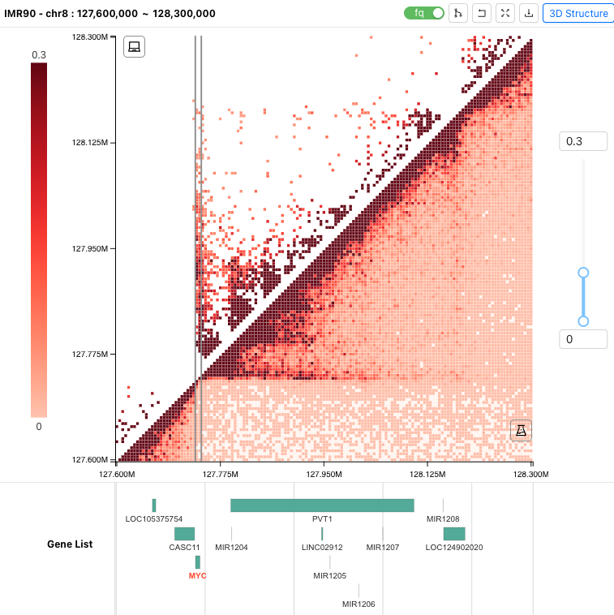

- The upper panel shows the contact information within the corresponding region of the selected cell sample.
  - The tool buttons on the top-right are:
    - FoldRec interactions pairwise comparison.
    - Restore the original heatmap.
    - Expand the heatmap view.
    - Download FoldRec interaction data.
    - Generate the 3D single-cell structures.
- The middle panel shows the heatmap of chromatin interactions.
  - The upper triangle of the heatmap shows the FoldRec inteactions and the lower triangle shows the experiment Hi-C data. The color scale represent the interaction frequency.
  - Users can change the color scale using the slide bar on the right.
  - Users can click and drag the heatmap to zoom in and out.
- The lower panel shows the informatins of all genes located in selected region, and users can select and click the gene to highlight it. Here we highlight MYC gene.

#### By clicking  (Expand the heatmap view), users can check the FoldRec interactions in details with epigenetic tracks from the ENCODE Portal or their own custom tracks

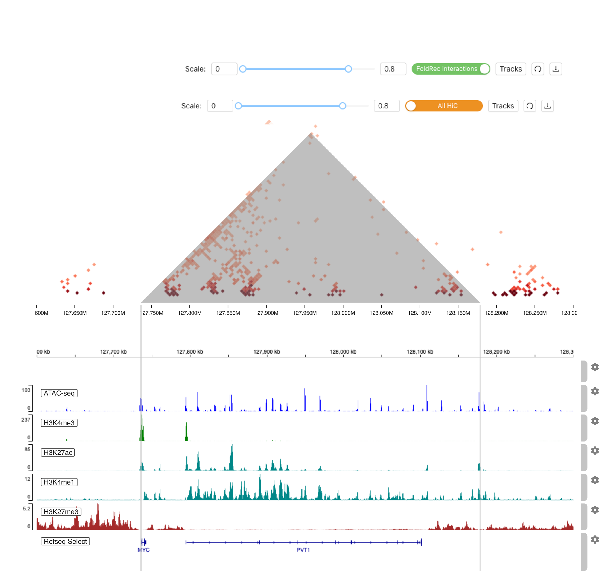

- The upper panel shows the tool buttons:
  - Scale bar to change the heatmap color scale.
  - Swith button to swich between FoldRec and experiment Hi-C interactions.
  - Tracks button to select epigenitic tracks from ENCODE or upload local files.
  - Refresh button to refresh the igv track viewer. (If the tracks and the heatmap are misaligned, "Refresh" is needed.)
  - Download the figures (PDF/PNG).
- The middle panel shows the FoldRec interactions. Users can click the heatmap to highlight the selected interactions.
- The lower panel is the embedded IGV Epigenitic Track Viewer. Users can search and select epigenetic data from the ENCODE Portal or upload their own tracks to annotate the interactions.

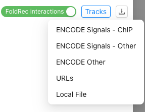

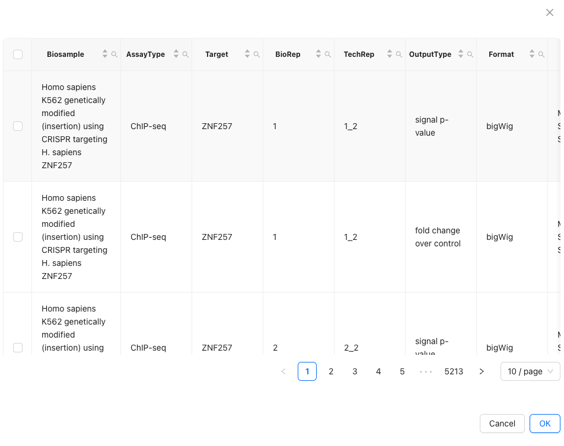

## Exploring the 3D single-cell chromatin structures

- Here we consistant with IMR90 chr8:127,600,000-128,300,000 as an example. Examine the MYC gene promoter-enhancer interactions in 3D chromatin conformations

- After examining the 2D contact information, users can click  to generate the 3D single-cell chromatin structures of the corresponding locus.

- From the Expand heatmap view, uesers can get the enhancer location information based on the epigenict tracks data. Then, users can type in the enhancer genomic location information to the search box on the top right to annotate the enhancer beads.

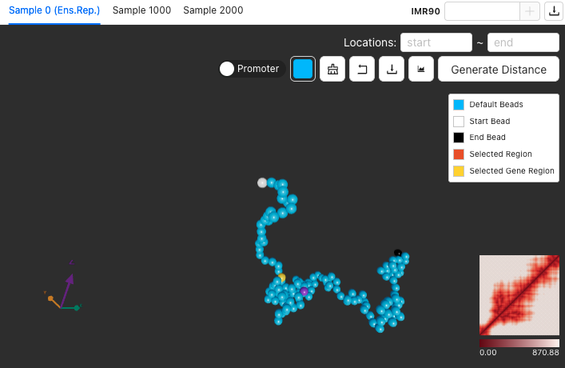

- The Sample 0 (Ens.Rep.) shows the most representative single-cell structure (highest correlation with average), and users can switch among all available structures or examine specific samples by entering a sample ID.
- Download 5,000 single-cell 3D chromatin chains, including positional coordinates and beads-to-beads distance matrices.
- The upper panel shows the tool buttons:
  - Regions of interest for beads selection.
  - Switch button to switch the TSS of the gene and whole selected gene.
  - Change the color of the selected beads.
  - Clear the bead selections.
  - Restore the original view.
  - Download the 3D chromosome image (PDF/PNG). User can also change the background color the chains before download the image.
  - Check the simulated Hi-C heatmap.
  - Generate pairwise distances for selected beads.
- The middle panel displays one of the simulated 3D single-cell chromatin structure. Users may interact with the model by clicking and dragging to examine its spatial organization.
- The lower right panel showed the distance heatmap of this 3D single-cell chromatin structure.

### 3D distance analysis

1. Select **first bead** you are interested in.
   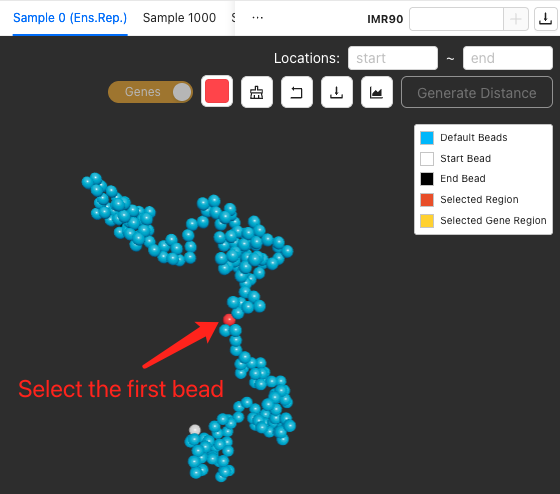

2. Change selected bead **color**  
   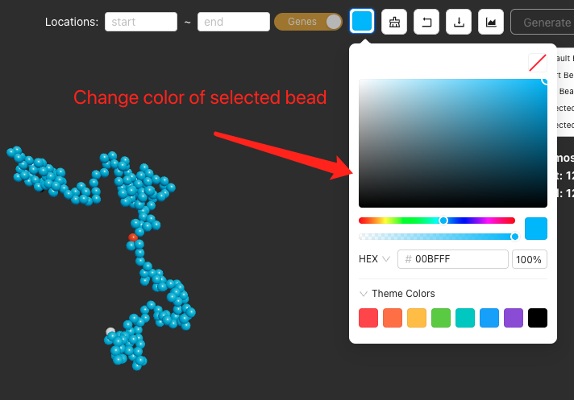

3. Select **second bead** you are interested in  
   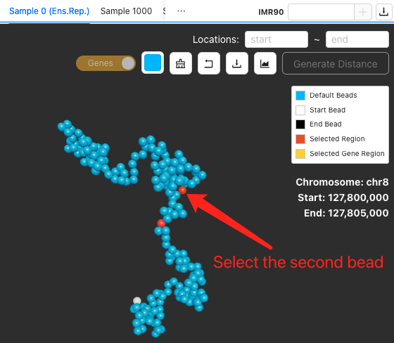

4. Change selected bead **color**  
   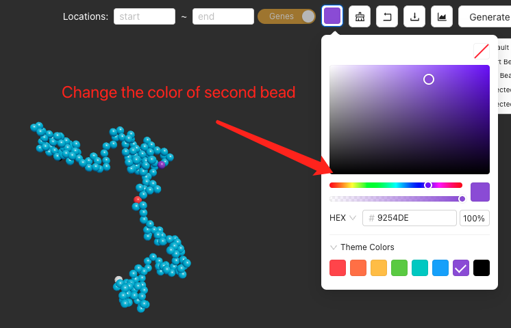
5. Click **Generate Distance** button  
   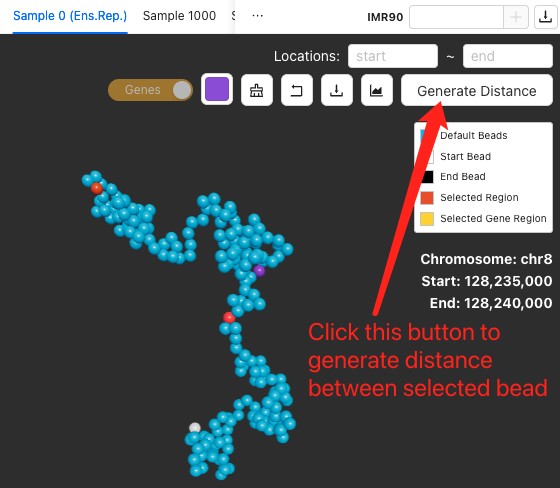

- We disabled this button until minimum number of beads selection is made.
- **Distances across multiple beads are supported; just select as many beads as you want to analyze.**

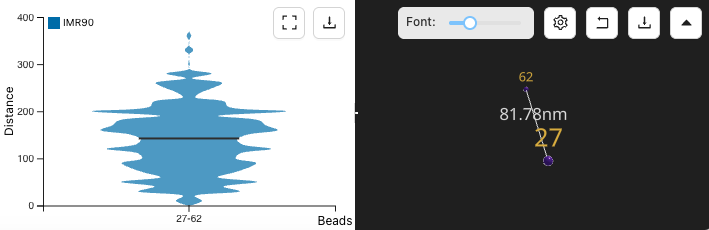

- The tool buttons on the left:
  - Zoom in
  - Download the figure
- The tool buttons on the right:
  - Adjust the Font size
  - Select which bead pair to show
  - Restore the original view.
  - Download the selected beads and their distance.
  - Collapse the distance window.

## Comparision among different cell samples

### 2D interaction pattern comparision

By clicking the + on the right of the data query bar. Users can Add Heatmap comparision to select other cell samples to do the FoldRec interactions comparision.

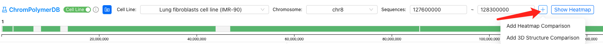

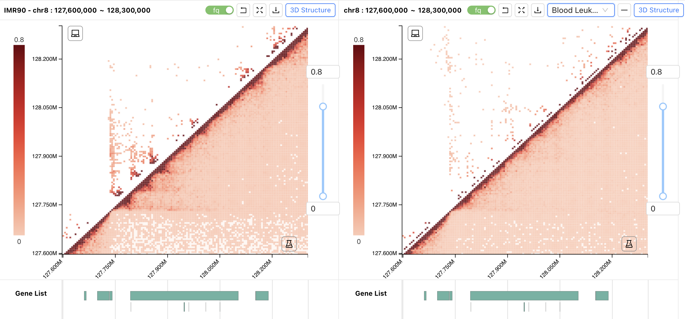

### 3D chromatin structures comparision

By clicking the + on the right of the data query bar. Users can select other cell samples from the dropbox to do the chromatin struction comparision.

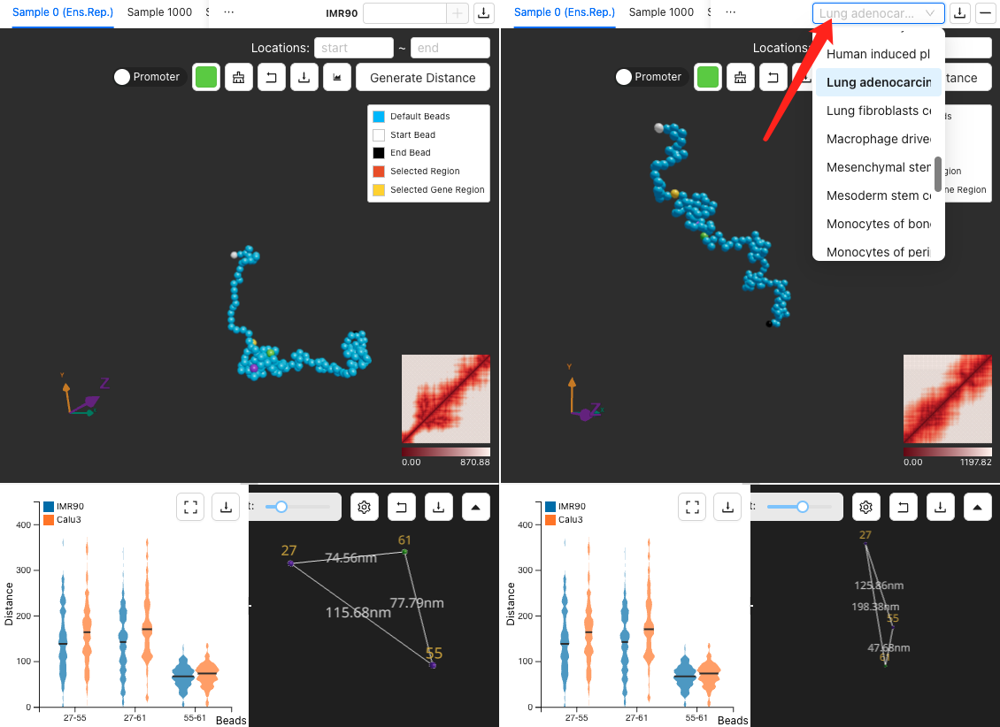

## Downstream structure data analysis

Both bead structure data (position data) and bead distance data of the selected region can be downloaded and used for downstream analysis. Please check the following codes for more details.

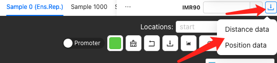

- [Distance data clustering](https://github.com/ldu3/ChromPolymerDB_tutorial/blob/main/scr/clustering.ipynb)

- [Position data to PDB files for structure visualization via PyMol](https://github.com/ldu3/ChromPolymerDB_tutorial/blob/main/scr/position_data_visualizaion.ipynb)

- [Multi-body contacts analysis](https://github.com/ldu3/ChromPolymerDB_tutorial/blob/main/scr/multibody_contacts.R)

## Incorporating Data from Existing Chromatin Resources

Users can download data from other publicly available chromatin databases and incorporate them into ChromPolymerDB for further analysis. Here we take HiChIPdb as an example.
Step-by-step guide:

- Download the .csv file from HiChIPdb (https://health.tsinghua.edu.cn/hichipdb/download.php). For consistency, we recommend using the 5 kb resolution data.
- Extract the columns: anchor1, anchor2, and qValue, and Reformat these columns into a .bedpe file, as shown in the figure below.

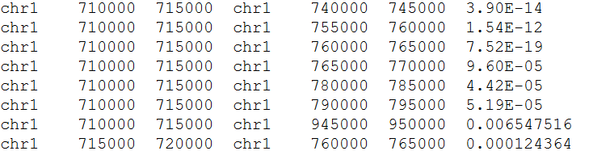

- Convert .bedpe files from hg19 to hg38.

```bash
   # Download the liftOver file
   wget https://hgdownload.cse.ucsc.edu/goldenpath/hg19/liftOver/hg19ToHg38.over.chain.gz

   # First round: liftOver the first anchors
   CrossMap bed hg19ToHg38.over.chain.gz hichipdb_GM12878_H3K27ac.bedpe hichipdb_GM12878_H3K27ac_hg38_1.bedp

   # Swap columns for the second anchors
   awk '{OFS="\t"}{print $4,$5,$6,$1,$2,$3,$7}' hichipdb_GM12878_H3K27ac_hg38_1.bedpe > hichipdb_GM12878_H3K27ac_hg38_2.bedpe

   # Second round: liftOver the second anchors
   CrossMap bed hg19ToHg38.over.chain.gz hichipdb_GM12878_H3K27ac_hg38_2.bedpe hichipdb_GM12878_H3K27ac_hg38.bedpe
```

- Upload the resulting .bedpe file to ChromPolymerDB for visualization and further analysis.

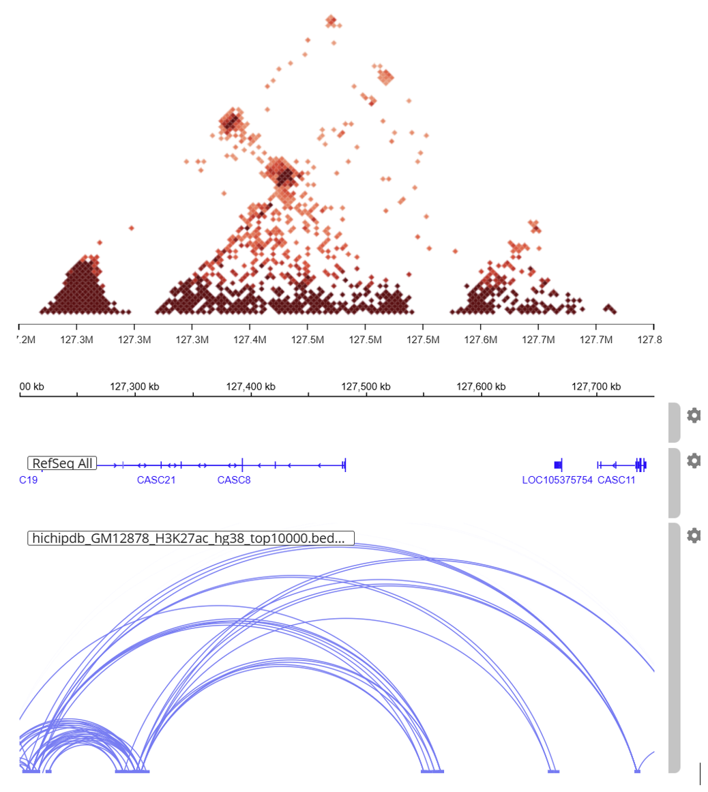

## Contributing Your Data

We warmly welcome users who wish to contribute their new datasets to be integrated into ChromPolymerDB. We accept a wide range of data types, including deeply sequenced bulk Hi-C (hg38), scHi-C, as well as other chromatin structure data generated from simulations or imaging.

- For bulk Hi-C data, we require the .hic file containing 5kb resolution data together with the corresponding nuclear volume.
- For scHi-C data, we require a .txt file containing 5kb intra-chromatin contacts, with four columns in the following format: chr loc1 loc2 counts
- For chromatin structure data, we require a matrix containing all pairwise distances between all loci.

## [HiC data resource](https://github.com/ldu3/ChromPolymerDB_tutorial/blob/main/Hi-C_info.xlsx)
